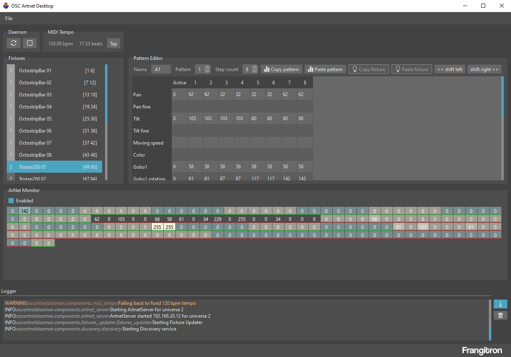

# OSC Artnet Desktop

**/!\ BETA VERSION**

- [OSC Artnet Daemon](https://github.com/MrFrangipane/osc-artnet-daemon)
- [OSC Artnet Fixtures](https://github.com/MrFrangipane/osc-artnet-fixtures)

This project uses [PySide6 helpers](https://github.com/MrFrangipane/pyside6-helpers) which icons were made by [Freepik](https://www.freepik.com/) and found on [Flat Icon](https://www.flaticon.com)

App Icon was generated with [Canvas](https://www.canva.com/dream-lab)
